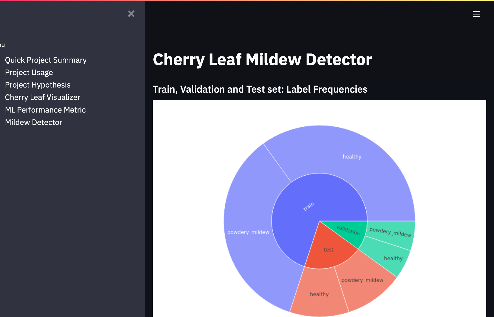

<h1 align=center>Cherry Leaf Mildew Detector</h1>

This website's machine learning technology offers a platform for users to upload photos of cherry leaves and detect whether or not they are healthy or infected with powdery mildew.

[Live application can be found here](https://pp5-mildew-detector-christian.herokuapp.com/)

## Table of Contents

1. [Planning Phase](#planning-phase)
    1. [Agile methodology - Development](#agile-methodology---development)
    2. [Crisp-DM: Definition and Usage](#crisp-dm-definition-and-usage)
    3. [Business Requirements](#business-requirements)
        1. [Project Goals](#project-goals)
        2. [Hypothesis and validation](#hypothesis-and-validation)
2. [Data Gathering Phase](#data-gathering-phase)
    1. [Dataset Content](#dataset-content)
        1. [Sample Leaves](#sample-leaves)
    2. [How to validate?](#how-to-validate)
    3. [Rationale to map the business requirements to the Data Visualizations and ML tasks](#rationale-to-map-the-business-requirements-to-the-data-visualizations-and-ml-tasks)
    4. [ML Business Case](#ml-business-case)
    5. [Data Understanding](#data-understanding)
3. [Project Execution Phase](#project-execution-phase)
    1. [Data Preparation](#data-preparation)
    2. [Modeling](#modeling)
    3. [Evaluation](#evaluation)
    4. [Dashboard Design (Streamlit App User Interface)](#dashboard-design-streamlit-app-user-interface)
        1. [Dashboard Wireframe](#dashboard-wireframe)
        2. [Page 1: Quick Project Summary](#page-1-quick-project-summary)
        3. [Page 2: Cherry leaf visualiser](#page-2-cherry-leaf-visualiser)
        4. [Page 3: Mildew detector](#page-3-mildew-detector)
        5. [Page 4: Project Hypothesis and Validation](#page-4-project-hypothesis-and-validation)
        6. [Page 5: ML performance metrics](#page-5-ml-performance-metrics)
    5. [Features](#features)
    6. [Bugs and Fixes](#bugs-and-fixes)
    7. [Manual Testing](#manual-testing)
    8. [Deployment](#deployment)
        1. [Workspace Setup](#workspace-setup)
        2. [Creating Heroku App](#creating-heroku-app)
        3. [Deploying to Heroku](#deploying-to-heroku)
4. [Summary](#summary)
    1. [Technologies Used](#technologies-used)
        1. [Main Data Analysis and Machine Learning Libraries](#main-data-analysis-and-machine-learning-libraries)
        2. [OtherFrameworks, Libraries & Programs Used](#otherframeworks-libraries--programs-used)
5. [Credits](#credits)
    1. [Content](#content)
    2. [Media](#media)
6. [Acknowledgements](#acknowledgements)

---

# Planning Phase

## Agile methodology - Development
- To ensure my project development stayed on track, I chose to implement a Kanban project to log any issues that arose.
- You'll find the Kanban Table Project readily available [here.](https://github.com/users/CBergane/projects/8)

---

## Crisp-DM: Definition and Usage

- Understand the business problem, objectives, and requirements by pinpointing stakeholders, defining the problem statement, and establishing project goals.
- Identify data sources and collect and explore data to determine its quality, completeness, and relevance to the project goals.
- Meticulously prepare the data through cleaning, transformation, and feature engineering.
- Select the most appropriate modelling technique to develop a model that best addresses the problem, which is subsequently validated and evaluated.
- Exhaustively evaluate the model to ensure it meets project goals, and carefully analyse and interpret the results.
- Deploy the model into production through a meticulously planned process that includes implementation and monitoring of its performance.

---

## Business Requirements
The cherry plantation crop from Farmy & Foods faces a challenge where their cherry plantations have been presenting powdery mildew. Currently, the process is to verify if a given cherry tree contains powdery mildew manually. An employee spends around 30 minutes in each tree, taking a few samples of tree leaves and demonstrating visually if the leaf tree is healthy or has powdery mildew. If it has powdery mildew, the employee applies a specific compound to kill the fungus. The time spent using this compound is 1 minute.  The company has thousands of cherry trees on multiple farms nationwide. As a result, this manual process could be more scalable due to the time spent in the manual process inspection.

To save time, the IT team suggested an ML system that can detect instantly, using a leaf tree image, if it is healthy or has powdery mildew. A similar manual process is in place for other crops for detecting pests. If this initiative is successful, there is a realistic chance to replicate this project in all other crops. The dataset is a collection of cherry leaf images provided by Farmy & Foods, taken from their crops.

### **Project Goals**

* 1 - The client is interested in conducting a study to visually differentiate a cherry leaf that is healthy and that contains powdery mildew.
* 2 - The client is interested to predict if a cherry leaf is healthy or contains powdery mildew.

### **Hypothesis and Validation**

- **Hypothesis one**
    - Through the utilization of machine learning algorithms, it is feasible to discriminate between cherry leaves that are contaminated with powdery mildew and those that are healthy based on their distinctive visual attributes. In general, cherry leaves that have been affected by powdery mildew display a visible powdery white or greyish coating on their surface, accompanied by prominent white or greyish marks.
- **Validation:**  
    The machine learning model effectively differentiated among various data points and used this knowledge to accurately forecast outcomes on new data without relying excessively on the training set. As a result, the model can offer reliable predictions for future observations by generalizing its forecasts. Instead of simply memorizing the correlations between features and labels in the training data, the model comprehends overall patterns, which boosts its predictive capacity. Remarkably, the model achieved a perfect accuracy of 100% in performing these tasks.

- **Hypothesis Two**
    - Based on the image data it has been trained on, the machine learning system can confidently differentiate between cherry leaves that are healthy and those that have been infected with powdery mildew. Its high level of accuracy, consistently at or above 90%, suggests that this classification task is both straightforward and well-suited to this particular method of analysis.
- **Validation:**  
    According to the model developed, the hypothesis has been validated with outstanding results in assessing the project's business functionality and triumph. The F1 score and recall for the powdery mildew label both reached an impressive 100%.
- **Hypothesis Three**
    - Integrating image visualization into the cherry leaf inspection process greatly minimizes the risk of misidentifying infected leaves.
- **Validation:**  
    While the ML model is indeed precise in its predictions, it may prove challenging to discern the visual characteristics of the disease during its early stages. However, to further enhance the accuracy of the model and achieve even better results, a staff member examines cases where the model lacks confidence during the prediction process visually. This process involves utilizing an image and a prediction plot in the Powdery Mildew Detection tab.
- **Hypothesis Four**
    - Implementing a machine learning solution is the way to go for improving the accuracy and speed of cherry leaf inspection. This will lead to more efficient use of resources, enhanced productivity, and greater worker safety. Furthermore, it will significantly cut down on the time and exposure required for manual cherry leaf inspection.
- **Validation:**  
    Based on the business case, it's clear that manually inspecting and treating 100 trees would take approximately 50 hours. However, using an ML model to analyse pictures of the leaves takes just a minute per tree. This means that taking pictures and uploading them for analysis would only require an hour and 40 minutes for all 100 trees. With the ML model being 100% accurate in detecting unhealthy trees, there's no longer a need for manual visual inspection.The employee can focus solely on the trees identified by the model as having powdery mildew and administer the appropriate compound. Implementing an ML model would significantly reduce the time needed to inspect and treat 100 trees, making the process much more efficient.
- **Hypothesis Five**
    - Through the implementation of ML prediction, the company can significantly reduce its reliance on manual labour for identifying powdery mildew on cherry leaves. This results in substantial cost savings and improved efficiency.
- **Validation:**  
    To assess the impact of the ML solution, we must compare the manual inspection process before and after implementation. Employee feedback can also provide valuable insight into the effectiveness of the system.

---

# Data Gathering Phase

## Dataset Content

* The dataset is sourced from [Kaggle](https://www.kaggle.com/codeinstitute/cherry-leaves). We created then a fictitious user story where predictive analytics can be applied in a real project in the workplace.
* The dataset contains +4 thousand images taken from the client's crop fields. The photos show healthy cherry leaves with powdery mildew, a fungal disease affecting a wide range of plants. The cherry plantation crop is one of their finest products in the portfolio, and the company is concerned about supplying the market with a compromised product.

### Sample leaves
---
| 	healthy											         	|											   	 podwery mildew leaf|
| ---													     	| ---															  	|
|| |

---

## How to validate?

* The tree leaves that have powdery mildew contains white streaks on them.
    -  conventional data analysis will be used to conduct a study to visually differentiate a healthy cherry leaf from one that contains powdery mildew.

---

## Rationale to map the business requirements to the Data Visualizations and ML tasks

* **Business Requirement 1**: Data Visualization
    To visually differentiate healthy and mildew-infested cherry leaves:
	* As a client, I want to display the "mean" and "standard deviation" images for healthy cherry leaves and cherry leaves that contain powdery mildew.
 	* As a client, I want to display the differences between an average healthy cherry leaf and a cherry leaf with powdery mildew.
	* As a client, I want to display an image montage for healthy cherry leaves and mildew-infested leaves.

* **Business Requirement 2**:  Classification
	* As a client, I want to predict if a given cherry leaf is healthy or contains powdery mildew so that I do not supply the market with a product of compromised quality. 
	* As a client, I want to build a binary classifier and generate reports.

## ML Business Case
* As a client, I want an ML model to predict if the cherry leaf tree is healthy or has powdery mildew.
* The ideal outcome is to provide Farmy & Foods with a faster and more reliable mildew detection mechanism that is readily scalable across the multiple farms in the country
* The model success metric is:
    * A study showing how to visually differentiate a healthy cherry leaf from one that contains powdery mildew.
    * The capability to predict if a cherry leaf is healthy or contains powdery mildew.
    * The model accuracy on test data is 100%

---

## Data Understanding

The data is labelled image data split into two folders, each representing the image label. For example, so healthy marked leaves images are in the healthy directory, while the mildew leaves are in the powder_mildew directory.

The classification dataset included 4208 records (2104 healthy leaves and 2104 infected leaves) and was a balanced dataset.

---

# Project Execution Phase

## Data Preparation
Minimal data cleaning was required, and the folders were scanned through to delete any non-image files. The dataset was split into the train, test and validation sets to perform model training and avoid model overfitting adequately. The split ratio of the dataset was 0.7, 0.2, and 0.1, respectively.
Data augmentation was performed using ImageDataGenerator on the training dataset to increase the image data by artificially and temporarily creating training images through the combination of different processes, such as random rotation, shifts, sheared, zoom and rotated images in the computer's short-term memory (RAM). ImageDataGenertor was also used to rescale the test dataset and validation dataset.

---

## Modeling
The sequential model used on the training dataset was used to train the model and validated using the validation dataset. 

The model created was used to predict the unseen test dataset, and the Accuracy performance metrics were calculated.

---

## Evaluation
The model accuracy on the test dataset is 100% which is the required percentage accuracy. To test further, I uploaded two leaves(healthy and mildew leaves shown under sample data above), which were not part of the dataset, were uploaded and were adequately predicted.

[Mildew Leaf](readmefiles/images/pp5-mildew-detector-christian.herokuapp.com-mildew.png)

[Healthy Leaf](readmefiles/images/pp5-mildew-detector-christian.herokuapp.com-healthy.png)

---

## Dashboard Design (Streamlit App User Interface)

### Dashboard Wireframe
The dashboard wireframe was created using Balsamiq.
This wireframe is a rough picture of the project's appearance when finished.

### Page 1: Quick Project Summary
* A summary page showing the project dataset summary and the client's requirements.
* Quick project summary
    * General Information
    * Project Dataset
        * The dataset contains +4 thousand images from the client's crop fields. The images show healthy cherry leaves that contain powdery mildew, a fungal disease affecting many plants. The cherry plantation crop is one of their finest products in the portfolio, and the company is concerned about supplying the market with a compromised product.

    * Business requirements
        *  The client is interested in conducting a study to visually differentiate a healthy cherry leaf from one that contains powdery mildew.
        *  The client is interested in predicting if a cherry tree is healthy or contains powdery mildew.

### Page 2: Project Usage
* A Page describing the usage of the project.
* Step-by-step guide on how to use the different pages.

### Page 3: Cherry leaf visualiser
* It will answer business requirement 1
    * Lists the findings related to the study to visually differentiate a healthy cherry leaf from one that contains powdery mildew.
    * Checkbox 1 - Difference between average and variability image
    * Checkbox 2 - Differences between Healthy and Powdery Mildew Cherry Leaves
    * Checkbox 3 - Image Montage

### Page 4: Project Hypothesis and Validation
* Display each project hypothesis and validation

### Page 5: ML performance metrics
* A technical page displaying the model performance

### Page 6: Mildew detector
* It will answer business requirement 2
    * Link to download a set of cherry leaf images for live prediction
    * File upload widget to upload one or more images for prediction
    * Display image and prediction statement indicating whether or not a cherry leaf contains mildew
    * Display table with the image name and prediction result
    * Download button to download the table

---

## **Features**
The application is designed using the Streamlit library. It has a sidebar menu with five navigation links.

**Navigation** The dashboard developed is a multipage Streamlit application with sidebar navigation checkbox links. The navigation links provide quick access to the five pages listed:

- **Page 1: Quick Project Summary**
This page displays a brief overview of the project requirements and the dataset.

- **Page 2: Project Usage**
This page serves to provide a comprehensive explanation of the various project pages and their usage.

- **Page 3: Hypothesis and Visualization**
This page shows the project hypothesis and how it is validated across the project.

 
- **Page 4: Cherry leaf visualiser**
This page displays a brief overview of the project requirements and the dataset.

 
- **Page 5: ML Performance Metric**
Technical information about the model and data are displayed on this page. It shows the:
  * label frequencies of the train, validation and test datasets.
  * training model accuracy and loss charts.
  * generalised performance on the test sets.

- **Page 6: Mildew Detector**
This provides the interface for the user to upload test samples and predict whether or not the examples provided are healthy or infested with powdery leaf mildew. It features a *Browse file* button, which the user can use to upload one or more image files. Prediction is only made once the user clicks the *Make Prediction* button. The image is uploaded, and the prediction and report are displayed to the user when the forecast is complete.

---

## Bugs and Fixes

Upon deployment of my project to Heroku, I encountered an issue with the Image Montage not being displayed. This was due to the exclusion of the directory containing the images from the GitHub push, which was done to address privacy concerns. As such, access to the data is limited to formally involved professionals in the project.

Found that Pylance throws a few errors in places when it can't make out what to do with the code, but it still works, so the errors are ignored.
    * For an example, Cannot access member "reshape" for type "tuple[Any, Any | Unknown]" Member "reshape" is unknown.

---

## Manual Testing

| Instructions | Expected Outcome | Results |
|----|----|----|
| Open up the project | Upon launching the app, rest assured that it will flawlessly load and promptly guide you to the summary page, free from any errors or interruptions. | Works as expected. |
| Navigate the summary page | Your overview of the project and problem statement was clear and to the point. The link to the readme file also opened flawlessly. | Works as expected. |
| Navigate the the Project Usage page | The reader can easily comprehend the project's different sections as they are presented in a clear and concise manner. | Works as expected. |
| Navigate to the Hypothesis page | The Project Hypothesis and Validations are thoroughly explained to the user and the expected outcome. | Works as expected |
| Navigate to the Cherry Leaf Visualizer page | The page presents a clear explanation and offers three options, each with a checkbox displayed in front of it. | Works as expected |
| Check the Difference between average and variability image checkbox | The image is introduced with a concise description, and subsequently displayed on the Jupyter notebook, effectively highlighting the distinction between the average and variability.| Works as expected |
| Check the Difference between Healthy and Powdery Mildew cherry leaves checkbox | Detailed explanations of the distinguishing factors between healthy leaves and those affected by powdery mildew are provided alongside corresponding images. | Works as expected |
| Check the Image Montage | You have the option to create a 3 x 3 grid of images featuring either healthy leaves or infected leaves. |
| Navigate to the ML Performance Metric page | For the project, there are different evaluation tools available such as the evaluation matrix, confusion matrix, precision, recall, F1 score, ROC curve, and model training history. You can access these tools to assess the project. | Works as expected |
| Natigatte to the Mildew Detector | The platform includes a feature where users can upload an image to determine if it is infected or not. Additionally, there is an option to download the generated report. | Works as expected|

---

## Deployment
Steps I took to setup environment and deploy to Heroku

### Workspace Setup
The repository for this project was created off the [template](https://github.com/Code-Institute-Solutions/milestone-project-mildew-detection-in-cherry-leaves) provided by Code Institute and GitPod workspace was used to develop this project.

- Click the `Use This Template` button.
- Add a repository name and brief description.
- Click the `Create Repository from Template` to create your repository.
- Click `Gitpod` to create a Gitpod workspace.
- To return to the current workspace, login to your gitpod acoount and open the workspace created earlier, since clicking on GitPod button on the GitHub page creates a new workpspace each time.

*Cloning the GitHub Repository*

Cloning your repository will enable you to work on a local version of the repository.

1. Navigate to [gitpod.io](https://gitpod.io)
2. Loginto you account.
3. Seartch for the reposotory cbergane-mildewdetector
4. Click "Open in VS Code Insiders on Desctop"
5. The app will lanch and you will get a SSH: key for the current session, save it just in case.

### Creating Heroku App
The Python version in the project is set to 3.8.13, which is not supported by Heroku's current default stack, heroku-22.
As a result of the above, the app was created from Heroku CLI and set to use buildstack heroku-20.

Steps take to create the app is as follows:
1. Download and install [Heroku CLI](https://devcenter.heroku.com/articles/heroku-cli) if not already installed
2. Copy API key from heroku
	- sign in and click on the avatar icon and select **Account Settings**
	- Scroll down to the API Key section and click **Reveal** button, and copy key displayed.
3. login to Heroku via the console and enter your details when prompted
	`heroku login -i`
	- enter key copied from step 2 when prompted for password
4. create the app
	`heroku apps:create pp5-mildew-detection --stack heroku-20 --region europe `

### Deploying to Heroku
1. Sign in to Heroku
2. Select app
3. At the Deploy tab, select GitHub as the deployment method.
4. Select your repository name and click Search. Once it is found, click Connect.
5. Select the branch you want to deploy, then click Deploy Branch.
6. The deployment process should happen smoothly in case all deployment files are fully functional. Click now the button Open App on the top of the page to access your App.

---

# Summary

## Technologies Used

### Main Data Analysis and Machine Learning Libraries
* [TensorFlow](https://www.tensorflow.org/overview) - version 2.6.0, used during image preprocessing to filter out corrupt images.
* [Keras](https://keras.io/) - version 2.6.0 for the CNN model.
* [Joblib](https://pypi.org/project/joblib/) - version 1.2.0 for saving and loading image shape.
* [Numpy](https://numpy.org/) - version 1.19.2 for array manipulation.
* [Pandas](https://pandas.pydata.org/) - version 1.1.2 for structuring the data.
* [Matplotlib](https://matplotlib.org/) version 3.3.1 for creating charts and plots for data visualization.
* [Seaborn](https://seaborn.pydata.org/) version 0.11.0, used in conjunction with Matplotlib for data visualization.
* [Plotly](https://plotly.com/) - version 4.12.0 for plotting charts for data visualization.
* [Streamlit](https://streamlit.io/) version 0.85.0 for dashboard development.
* [Scikit-learn](https://scikit-learn.org/stable/) - version 0.24.2 for data processing.
* [Jupyter notebook](https://jupyter.org) - used for writing and running the ML pipelines 
* [Protocol Buffers](https://protobuf.dev/) - version 3.20.0 for defining the structure of the message data.

### OtherFrameworks, Libraries & Programs Used
* [Git](https://git-scm.com/) - used for version control by utilizing the Gitpod terminal to commit to Git and Push to GitHub.
* [GitHub:](https://github.com/) - used to store the projects code after being pushed from Git.
* [Balsamiq:](https://balsamiq.com/) - Balsamiq was used to create the Dashboard [wireframes](docs/project_wireframe.pdf) during the design process.
* [Heroku](https://www.heroku.com/) - Deployment platform for the project.
* [VS Code Insiders](https://code.visualstudio.com/insiders//) - VS Code Insiders was used for development of the project.
* [AmIResponsive](http://ami.responsivedesign.is/) - Used to generate responsive image used in README file.

## Credits 
I have used youtube as an inspiration for this project [Chanel](https://www.youtube.com/watch?v=dGtDTjYs3xc&list=PLeo1K3hjS3ut49PskOfLnE6WUoOp_2lsD&index=1)
And i have used the walkthrue project on malaria detector. [Link](https://github.com/Code-Institute-Solutions/WalkthroughProject01)

### Content 

- The codes used to implement the functionalities in the project are from the Code Institute training by GyanShashwat1611 at [Github site](https://github.com/GyanShashwat1611/WalkthroughProject01/)
- Dataset is from [Kaggle](https://www.kaggle.com/codeinstitute/cherry-leaves)

### Media

- The images used in the readme and as sample download files on the dashboard are sourced from [dearjapanese](https://www.dearjapanese.com/cherry-tree-problems/) and [woodlandtrust](https://www.woodlandtrust.org.uk/trees-woods-and-wildlife/british-trees/a-z-of-british-trees/sour-cherry/).

## Acknowledgements
* I would like to send acknowledgements to my mentor Marcel and to my Slack community for helping me with code when I got stuck.