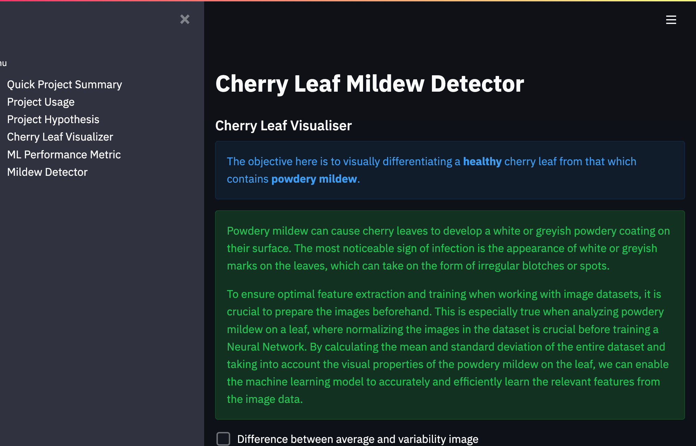

<h1 align=center>Cherry Leaf Mildew Detector</h1>

This website's machine learning technology offers a platform for users to upload photos of cherry leaves and detect whether or not they are healthy or infected with powdery mildew.

[Live application can be found here](https://pp5-mildew-detector-christian.herokuapp.com/)

# Planning Phase

## Business Requirements
The cherry plantation crop from Farmy & Foods faces a challenge where their cherry plantations have been presenting powdery mildew. Currently, the process is to verify if a given cherry tree contains powdery mildew manually. An employee spends around 30 minutes in each tree, taking a few samples of tree leaves and demonstrating visually if the leaf tree is healthy or has powdery mildew. If it has powdery mildew, the employee applies a specific compound to kill the fungus. The time spent using this compound is 1 minute.  The company has thousands of cherry trees on multiple farms nationwide. As a result, this manual process could be more scalable due to the time spent in the manual process inspection.

To save time, the IT team suggested an ML system that can detect instantly, using a leaf tree image, if it is healthy or has powdery mildew. A similar manual process is in place for other crops for detecting pests. If this initiative is successful, there is a realistic chance to replicate this project in all other crops. The dataset is a collection of cherry leaf images provided by Farmy & Foods, taken from their crops.

### **Project Goal:**

* 1 - The client is interested in conducting a study to visually differentiate a cherry leaf that is healthy and that contains powdery mildew.
* 2 - The client is interested to predict if a cherry leaf is healthy or contains powdery mildew.

## Dataset Content

* The dataset is sourced from [Kaggle](https://www.kaggle.com/codeinstitute/cherry-leaves). We created then a fictitious user story where predictive analytics can be applied in a real project in the workplace.
* The dataset contains +4 thousand images taken from the client's crop fields. The photos show healthy cherry leaves with powdery mildew, a fungal disease affecting a wide range of plants. The cherry plantation crop is one of their finest products in the portfolio, and the company is concerned about supplying the market with a compromised product.

### Sample leaves
---
| 	healthy											         	|											   	 podwery mildew leaf|
| ---													     	| ---															  	|
|| |

## Hypothesis and how to validate?

* The tree leaves that have powdery mildew contains white streaks on them.
    -  conventional data analysis will be used to conduct a study to visually differentiate a healthy cherry leaf from one that contains powdery mildew.

## Rationale to map the business requirements to the Data Visualizations and ML tasks
* **Business Requirement 1**: Data Visualization
    To visually differentiate healthy and mildew-infested cherry leaves:
	* As a client, I want to display the "mean" and "standard deviation" images for healthy cherry leaves and cherry leaves that contain powdery mildew.
 	* As a client, I want to display the differences between an average healthy cherry leaf and a cherry leaf with powdery mildew.
	* As a client, I want to display an image montage for healthy cherry leaves and mildew-infested leaves.

* **Business Requirement 2**:  Classification
	* As a client, I want to predict if a given cherry leaf is healthy or contains powdery mildew so that I do not supply the market with a product of compromised quality. 
	* As a client, I want to build a binary classifier and generate reports.

## ML Business Case
* As a client, I want an ML model to predict if the cherry leaf tree is healthy or has powdery mildew.
* The ideal outcome is to provide Farmy & Foods with a faster and more reliable mildew detection mechanism that is readily scalable across the multiple farms in the country
* The model success metric is:
    * A study showing how to visually differentiate a healthy cherry leaf from one that contains powdery mildew.
    * The capability to predict if a cherry leaf is healthy or contains powdery mildew.
    * The model accuracy on test data is 100%

---

## Data Understanding

The data is labelled image data split into two folders, each representing the image label. For example, so healthy marked leaves images are in the healthy directory, while the mildew leaves are in the powder_mildew directory.

The classification dataset included 4208 records (2104 healthy leaves and 2104 infected leaves) and was a balanced dataset.

## Data Preparation
Minimal data cleaning was required, and the folders were scanned through to delete any non-image files. The dataset was split into the train, test and validation sets to perform model training and avoid model overfitting adequately. The split ratio of the dataset was 0.7, 0.2, and 0.1, respectively.
Data augmentation was performed using ImageDataGenerator on the training dataset to increase the image data by artificially and temporarily creating training images through the combination of different processes, such as random rotation, shifts, sheared, zoom and rotated images in the computer's short-term memory (RAM). ImageDataGenertor was also used to rescale the test dataset and validation dataset.

## Modeling
The sequential model used on the training dataset was used to train the model and validated using the validation dataset. 

The model created was used to predict the unseen test dataset, and the Accuracy performance metrics were calculated.

## Evaluation
The model accuracy on the test dataset is 100% which is the required percentage accuracy. To test further, I uploaded two leaves(healthy and mildew leaves shown under sample data above), which were not part of the dataset, were uploaded and were adequately predicted.

[Mildew Leaf](readmefiles/images/pp5-mildew-detector-christian.herokuapp.com-mildew.png)

[Healthy Leaf](readmefiles/images/pp5-mildew-detector-christian.herokuapp.com-healthy.png)

---

## Dashboard Design (Streamlit App User Interface)

### Dashboard Wireframe
The dashboard wireframe was created using Balsamiq. The wireframe is in pdf format and can be viewed [here](readmefiles/mildew-detector.pdf)

### Page 1: Quick Project Summary
* A summary page showing the project dataset summary and the client's requirements.
* Quick project summary
    * General Information
    * Project Dataset
        * The dataset contains +4 thousand images from the client's crop fields. The images show healthy cherry leaves that contain powdery mildew, a fungal disease affecting many plants. The cherry plantation crop is one of their finest products in the portfolio, and the company is concerned about supplying the market with a compromised product.

    * Business requirements
        *  The client is interested in conducting a study to visually differentiate a healthy cherry leaf from one that contains powdery mildew.
        *  The client is interested in predicting if a cherry tree is healthy or contains powdery mildew.

### Page 2: Cherry leaf visualiser
* It will answer business requirement 1
    * Lists the findings related to the study to visually differentiate a healthy cherry leaf from one that contains powdery mildew.
    * Checkbox 1 - Difference between average and variability image
    * Checkbox 2 - Differences between Healthy and Powdery Mildew Cherry Leaves
    * Checkbox 3 - Image Montage

### Page 3: Mildew detector
* It will answer business requirement 2
    * Link to download a set of cherry leaf images for live prediction
    * File upload widget to upload one or more images for prediction
    * Display image and prediction statement indicating whether or not a cherry leaf contains mildew
    * Display table with the image name and prediction result
    * Download button to download the table

### Page 4: Project Hypothesis and Validation
* Display each project hypothesis and validation

### Page 5: ML performance metrics
* A technical page displaying the model performance

## **Features**
The application is designed using the Streamlit library. It has a sidebar menu with five navigation links.

**Navigation** The dashboard developed is a multipage Streamlit application with sidebar navigation checkbox links. The navigation links provide quick access to the five pages listed:

- **Page 1: Quick Project Summary**
This page displays a brief overview of the project requirements and the dataset.

- **Page 2: Hypothesis and Visualization**
This page shows the project hypothesis and how it is validated across the project.

 
- **Page 3: Cherry leaf visualiser**
This page displays a brief overview of the project requirements and the dataset.

 
- **Page 4: ML Performance Metric**
Technical information about the model and data are displayed on this page. It shows the:
  * label frequencies of the train, validation and test datasets.
  * training model accuracy and loss charts.
  * generalised performance on the test sets.

  

- **Page 5: Mildew Detector**
This provides the interface for the user to upload test samples and predict whether or not the examples provided are healthy or infested with powdery leaf mildew. It features a *Browse file* button, which the user can use to upload one or more image files. Prediction is only made once the user clicks the *Make Prediction* button. The image is uploaded, and the prediction and report are displayed to the user when the forecast is complete.

---

## Bugs and Fixes

Upon deployment of my project to Heroku, I encountered an issue with the Image Montage not being displayed. This was due to the exclusion of the directory containing the images from the GitHub push, which was done to address privacy concerns. As such, access to the data is limited to formally involved professionals in the project.

## Deployment
Steps I took to setup environment and deploy to Heroku

### Workspace Setup
The repository for this project was created off the [template](https://github.com/Code-Institute-Solutions/milestone-project-mildew-detection-in-cherry-leaves) provided by Code Institute and GitPod workspace was used to develop this project.

- Click the `Use This Template` button.
- Add a repository name and brief description.
- Click the `Create Repository from Template` to create your repository.
- Click `Gitpod` to create a Gitpod workspace.
- To return to the current workspace, login to your gitpod acoount and open the workspace created earlier, since clicking on GitPod button on the GitHub page creates a new workpspace each time.

*Cloning the GitHub Repository*

Cloning your repository will enable you to work on a local version of the repository.

1. Navigate to [gitpod.io](https://gitpod.io)
2. Loginto you account.
3. Seartch for the reposotory cbergane-mildewdetector
4. Click "Open in VS Code Insiders on Desctop"
5. The app will lanch and you will get a SSH: key for the current session, save it just in case.

### Creating Heroku App
The Python version in the project is set to 3.8.13, which is not supported by Heroku's current default stack, heroku-22.
As a result of the above, the app was created from Heroku CLI and set to use buildstack heroku-20.

Steps take to create the app is as follows:
1. download and install [Heroku CLI](https://devcenter.heroku.com/articles/heroku-cli) if not already installed
2. Copy API key from heroku
	- sign in and click on the avatar icon and select **Account Settings**
	- Scroll down to the API Key section and click **Reveal** button, and copy key displayed.
3. login to Heroku via the console and enter your details when prompted
	`heroku login -i`
	- enter key copied from step 2 when prompted for password
4. create the app
	`heroku apps:create pp5-mildew-detection --stack heroku-20 --region europe `

### Deploying to Heroku
1. Sign in to Heroku
2. Select app
3. At the Deploy tab, select GitHub as the deployment method.
4. Select your repository name and click Search. Once it is found, click Connect.
5. Select the branch you want to deploy, then click Deploy Branch.
6. The deployment process should happen smoothly in case all deployment files are fully functional. Click now the button Open App on the top of the page to access your App.

## Technologies Used

### Main Data Analysis and Machine Learning Libraries
* [TensorFlow](https://www.tensorflow.org/overview) - version 2.6.0, used during image preprocessing to filter out corrupt images.
* [Keras](https://keras.io/) - version 2.6.0 for the CNN model.
* [Joblib](https://pypi.org/project/joblib/) - version 1.2.0 for saving and loading image shape.
* [Numpy](https://numpy.org/) - version 1.19.2 for array manipulation.
* [Pandas](https://pandas.pydata.org/) - version 1.1.2 for structuring the data.
* [Matplotlib](https://matplotlib.org/) version 3.3.1 for creating charts and plots for data visualization.
* [Seaborn](https://seaborn.pydata.org/) version 0.11.0, used in conjunction with Matplotlib for data visualization.
* [Plotly](https://plotly.com/) - version 4.12.0 for plotting charts for data visualization.
* [Streamlit](https://streamlit.io/) version 0.85.0 for dashboard development.
* [Scikit-learn](https://scikit-learn.org/stable/) - version 0.24.2 for data processing.
* [Jupyter notebook](https://jupyter.org) - used for writing and running the ML pipelines 
* [Protocol Buffers](https://protobuf.dev/) - version 3.20.0 for defining the structure of the message data.

### OtherFrameworks, Libraries & Programs Used
* [Git](https://git-scm.com/) - used for version control by utilizing the Gitpod terminal to commit to Git and Push to GitHub.
* [GitHub:](https://github.com/) - used to store the projects code after being pushed from Git.
* [Balsamiq:](https://balsamiq.com/) - Balsamiq was used to create the Dashboard [wireframes](docs/project_wireframe.pdf) during the design process.
* [Heroku](https://www.heroku.com/) - Deployment platform for the project.
* [VS Code Insiders](https://code.visualstudio.com/insiders//) - VS Code Insiders was used for development of the project.
* [AmIResponsive](http://ami.responsivedesign.is/) - Used to generate responsive image used in README file.

## Credits 
I have used youtube as an inspiration for this project [Chanel](https://www.youtube.com/watch?v=dGtDTjYs3xc&list=PLeo1K3hjS3ut49PskOfLnE6WUoOp_2lsD&index=1)
And i have used the walkthrue project on malaria detector. [Link](https://github.com/Code-Institute-Solutions/WalkthroughProject01)

### Content 

- The codes used to implement the functionalities in the project are from the Code Institute training by GyanShashwat1611 at [Github site](https://github.com/GyanShashwat1611/WalkthroughProject01/)
- Dataset is from [Kaggle](https://www.kaggle.com/codeinstitute/cherry-leaves)

### Media

- The images used in the readme and as sample download files on the dashboard are sourced from [dearjapanese](https://www.dearjapanese.com/cherry-tree-problems/) and [woodlandtrust](https://www.woodlandtrust.org.uk/trees-woods-and-wildlife/british-trees/a-z-of-british-trees/sour-cherry/).

## Acknowledgements
* I would like to send acknowledgements to my mentor Marcel and to my Slack community for helping me with code when I got stuck.